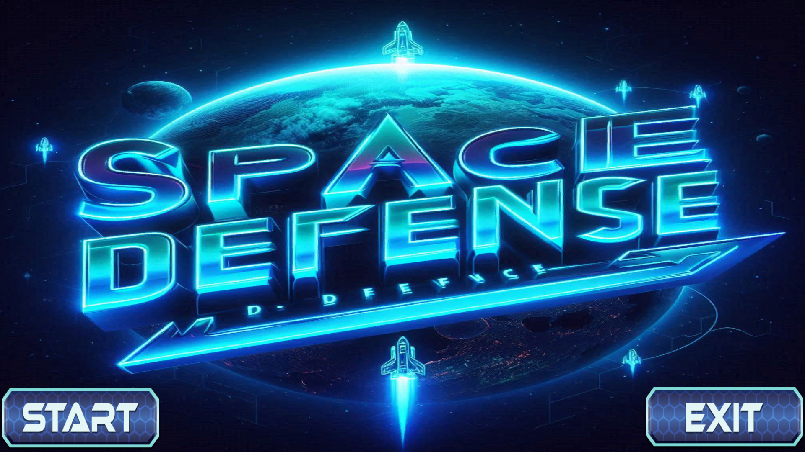
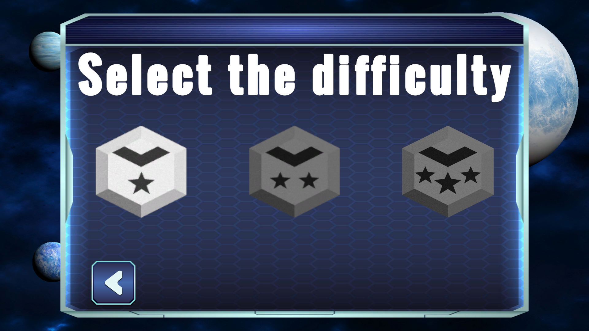
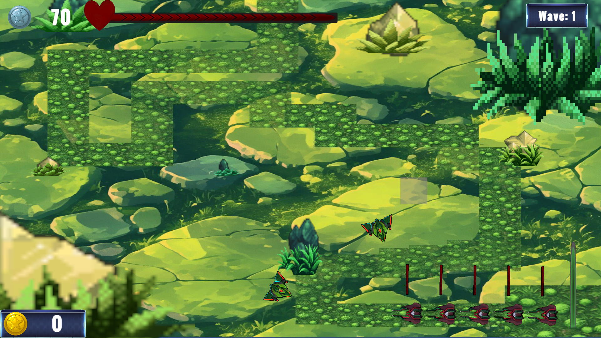
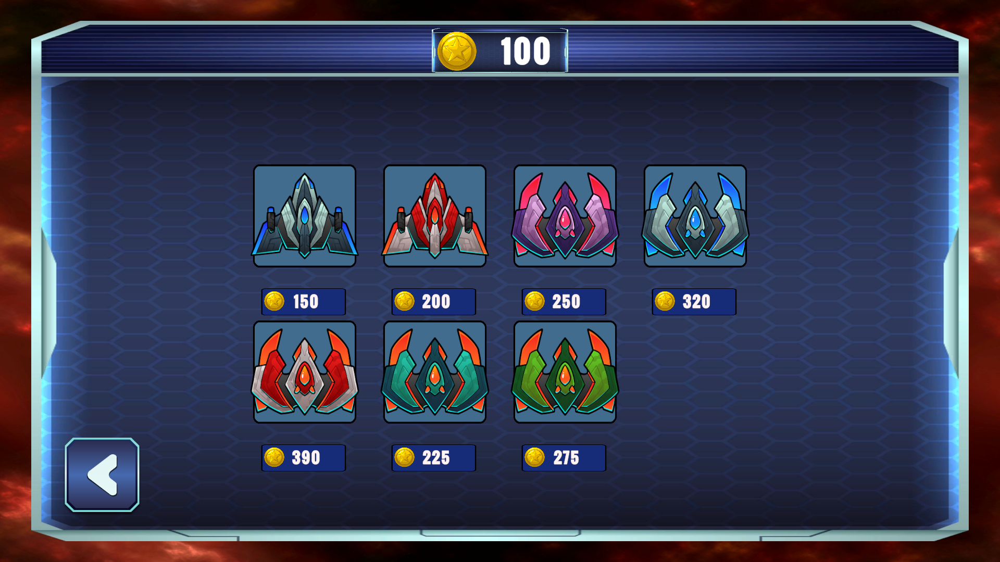

# ¡Hola! Soy Nazaret, programadora junior de videojuegos

## Sobre mí
Actualmente estoy finalizando el curso de Programación de Videojuegos en Tokio School y próximamente realizaré las prácticas profesionales para completar mi formación. Estoy especializada en desarrollo con Unity y C#. Busco oportunidades para seguir aprendiendo y aportar en la industria del gaming.

---

## Mis proyectos destacados

### Proyecto final del curso: "Space Tower Defense"

Un juego de tipo Tower Defense ambientado en el espacio, donde el jugador debe construir torres para defenderse de oleadas de naves enemigas. Desarrollé todo el juego de forma individual, incluyendo las mecánicas principales de defensa, el sistema de oleadas y la interfaz de usuario.

## Capturas del juego

---

## Habilidades técnicas

- Programación en C#  
- Desarrollo en Unity  
- Manejo de control de versiones con Git y GitHub  
- Conceptos básicos de diseño de juegos

---

## Contacto

- Email: magnan7979@gmail.com/ nazaretrojasespinosa@gmail.com 
- LinkedIn:  
- GitHub: https://github.com/NazaretRojas
