#  ¡Hola! Soy Nazaret

Soy programadora junior especializada en Unity y C#.  
Estoy finalizando el curso de Programación de Videojuegos en Tokio School y comenzaré mis prácticas profesionales pronto.

---

## 🎮 Proyecto destacado: Space Tower Defense

Un Tower Defense ambientado en el espacio, donde el jugador defiende su base de oleadas de naves enemigas.  
**Desarrollado 100% por mí** como proyecto final del curso.

🖥️ [Ver video del gameplay](https://youtu.be/LxtDWW0CiAQ)

### 🖼️ Capturas del juego

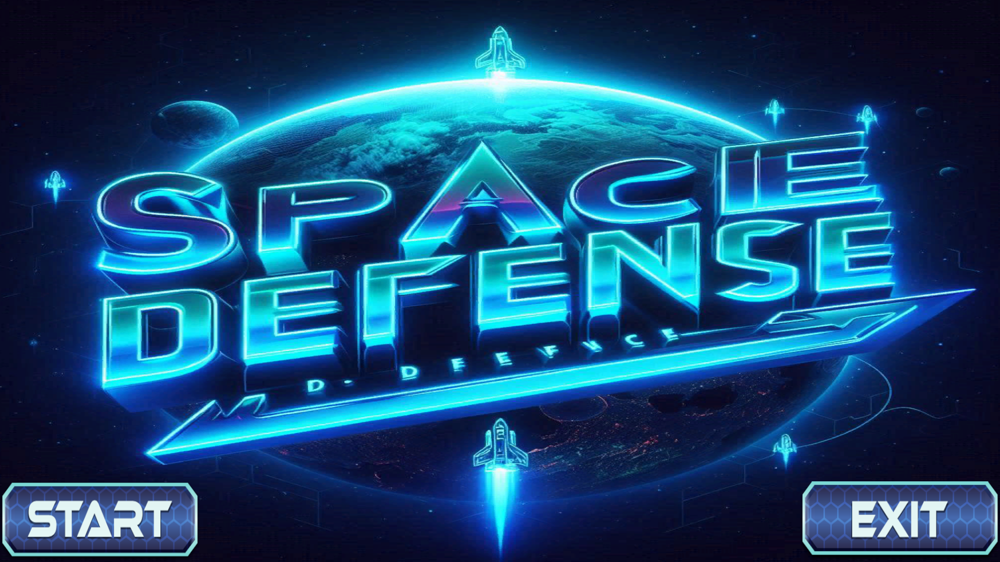
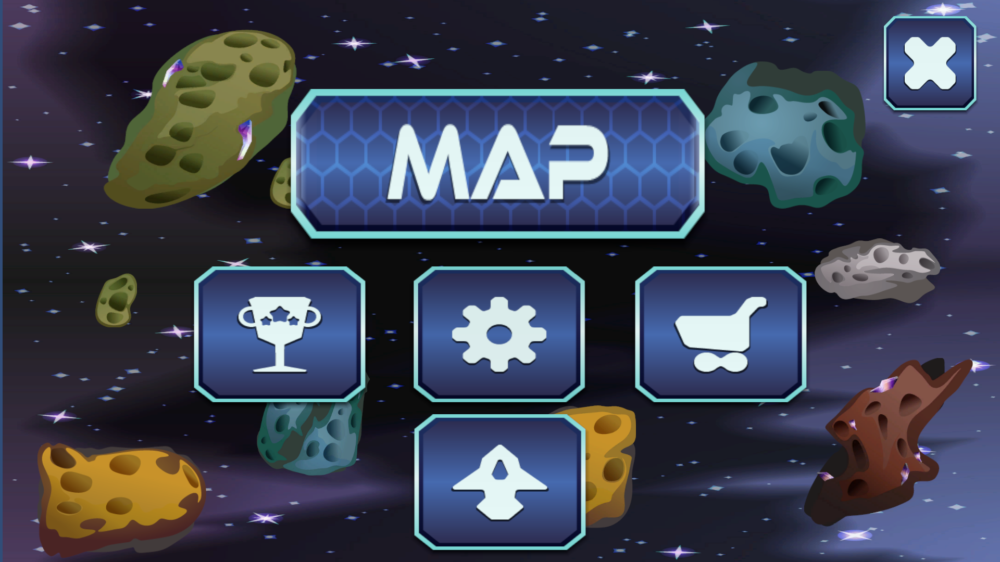
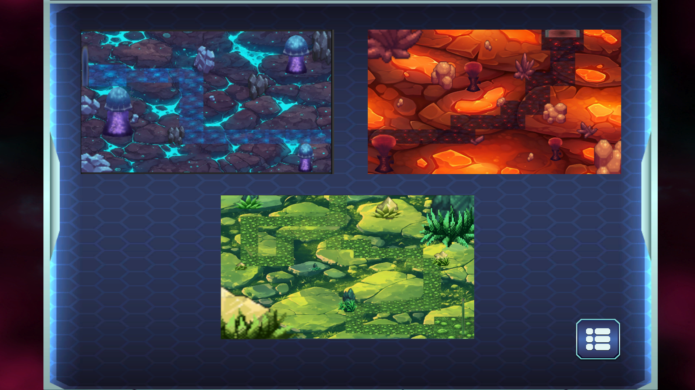
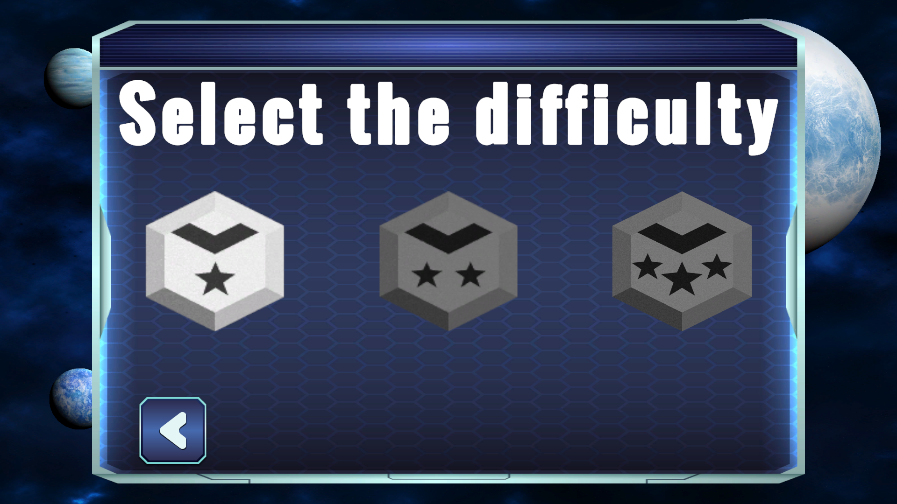
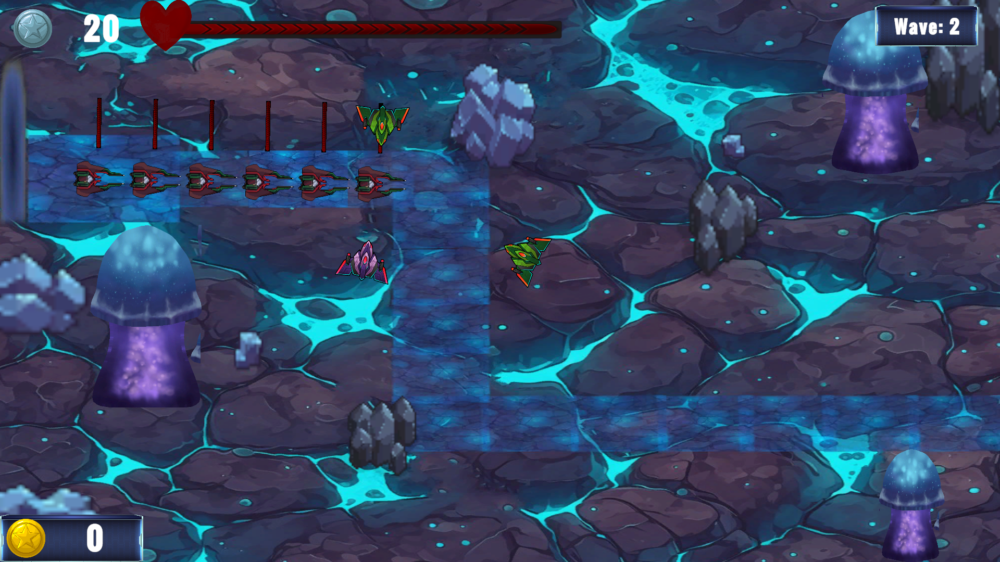
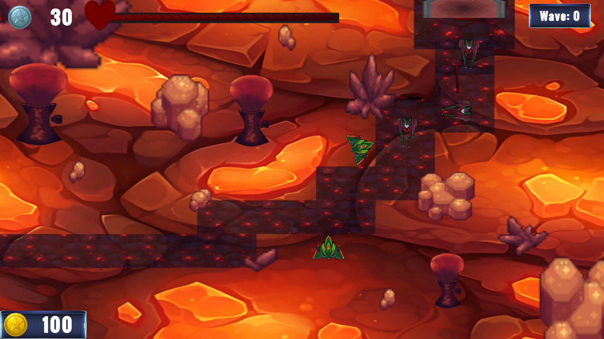
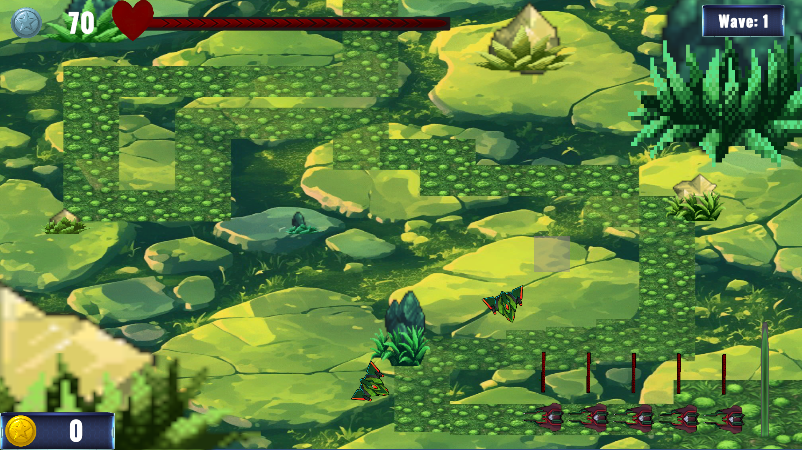
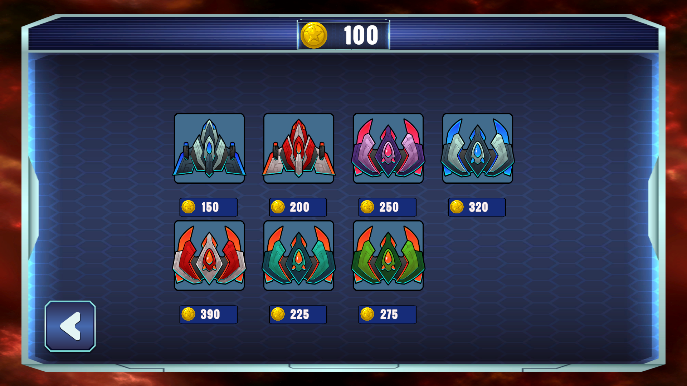

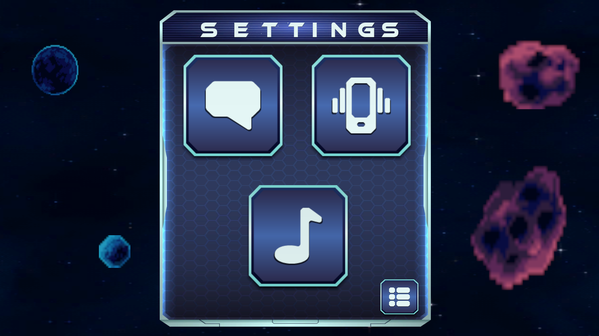

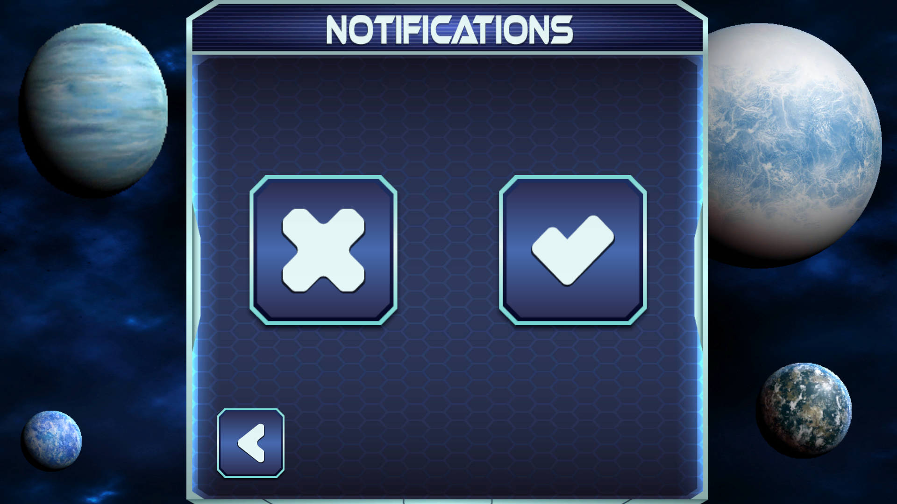
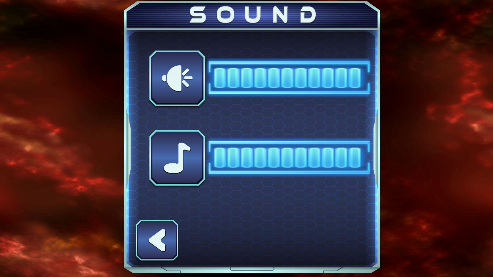

---

## 🛠️ Habilidades técnicas

- Programación en C#  
- Desarrollo en Unity  
- Control de versiones con Git y GitHub  
- Fundamentos de diseño de videojuegos

---

## 📫 Contacto

- 📧 Email: magnan7979@gmail.com 7 nazaretrojasespinosa@gmail.com
- 🔗 LinkedIn: [linkedin.com/in/TU-URL-DE-LINKEDIN](https://www.linkedin.com/in/nazaret-rojas-espinosa-682a77372/?trk=opento_sprofile_details)
- 💼 GitHub: [NazaretRojas](https://github.com/NazaretRojas)
